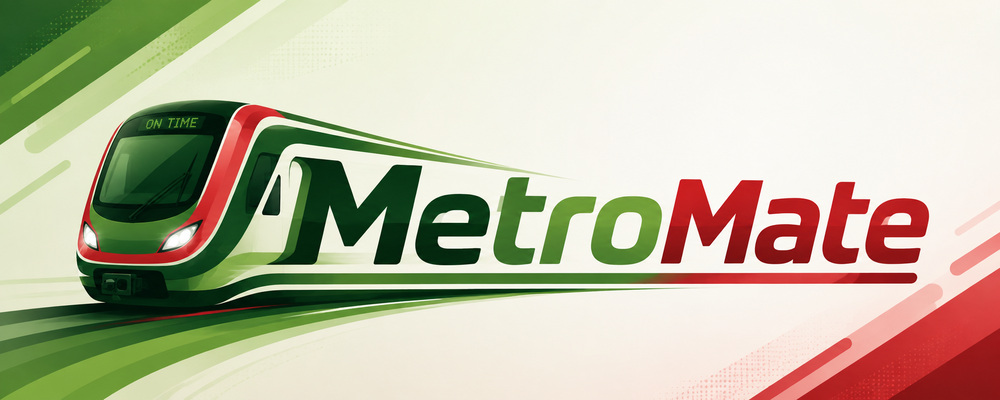

</img>

<!-- <h1 align="center">  <b>MetroMate</b></h1> -->
<h1 align="center"><b>MetroMate</b></h1>

A convenient Android app for checking your Dhaka MRT Card balance on the go.

Metro Mate is an unofficial Android app designed to check the balance of your Dhaka MRT Card. This app is not affiliated with DMTCL, JICA, Government of Bangladesh or any of its affiliates.
Inspired from MRT Buddy.

## Features
- Completely offline.
- Just one tap to check balance
- Works with both MRT Pass and Rapid Pass
- View transaction history[^1]
- Travel fare calculator

[^1]: The card only stores up to 20 transactions, regularly scanning your card allows you to build a comprehensive history of thousands of transactions on your phone.

> [!IMPORTANT]
> Your phone must be NFC Compatible to use the app.

> [!Note]
> This is an independent project and is not officially endorsed by or affiliated with Dhaka Mass Transit Company Limited (DMTCL).